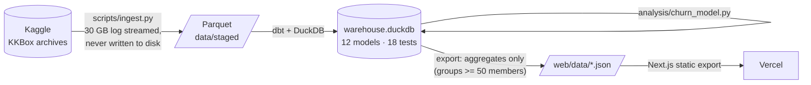

# Subscription Churn Analytics

**Revenue, retention and churn analysis of real subscription data. 20M billing transactions and 400M listening events from KKBox, Asia's largest music-streaming service, turned into an MRR bridge, cohort retention, and a churn model that is tested out-of-time.**

**Live site:** _coming with the first KKBox build_ · Static, so it never sleeps and loads instantly.

---

## Questions it answers

1. **Where does revenue come from, and where does it leak?** A monthly MRR bridge (new, reactivation, expansion, contraction, churn) that reconciles to the cent.
2. **How long do members stay?** Cohort retention, plus trailing-12-month net and gross revenue retention (the standard definition, not the one-month ratio that often gets mislabelled as NRR).
3. **Why do members churn?** Churn rate at each renewal decision by billing setup, tenure, plan, price, and listening behaviour, plus the split between people who cancelled, people who just didn't renew, and auto-renewals that failed.
4. **Can we see churn coming?** A rule-based score, logistic regression and gradient boosting, trained on 2016 and scored once on Jan–Feb 2017, compared by AUC and by the share of churners each reaches in its top-risk decile.

## Findings

_To be written from the first full KKBox run. Every number on the site is computed from the data at build time; nothing in the copy is hard-coded._

## How it works



| Layer | Model | What it does |
|---|---|---|
| staging | `stg_transactions`, `stg_members`, `stg_user_logs_monthly` | Types, cleaning (e.g. KKBox's notoriously dirty age field), revenue normalised to 30 days |
| intermediate | `int_billing_events` | One billing event per member per day; a same-day cancellation wins over a renewal |
| | `int_billing_events_sequenced` | **Gaps-and-islands**: splits events into continuous subscription spells; a lapse of 30 days or less is a late renewal, not churn |
| | `int_paying_months` | Month-end snapshots; price via `ASOF JOIN` to the latest paid period |
| marts | `fct_subscriber_months` | Every member-month classified: new / expansion / contraction / churned / reactivation / retained |
| | `mrr_bridge_monthly` | MRR bridge, subscriber churn rate, monthly and trailing-12-month NRR/GRR |
| | `cohort_retention` | Logo and revenue retention by first-paid month (fully observed cells only) |
| | `fct_renewal_decisions` | One row per paid period at expiry: churned or renewed, plus features known beforehand. Censored periods are dropped |

**Tests** (`dbt build` runs them): the MRR bridge reconciles every month (`beginning + gains − losses = ending`), grain uniqueness on every table, accepted movement types, and retention and churn rates within [0, 1].

**Definitions worth defending in an interview**
- *Churn* = no new paid period within 30 days of expiry. This is the competition's own definition, and the site shows how often our flag agrees with Kaggle's published labels.
- *MRR* = latest paid price × 30 ÷ plan days, for members whose spell covers the month's last day. Kept in NT$; no invented FX rate.
- *NRR (T12M)* = revenue today from members paying 12 months ago ÷ what they paid then.
- *Model evaluation* = out-of-time split, model chosen on validation, test scored once. A listening-only variant shows how much behaviour reveals before any billing action.

## Reproduce

```bash
make setup        # Python env (.pyenv) + web deps
make data         # Kaggle download + staging — see scripts/fetch_kkbox.sh for the one-time token setup
make all          # dbt build + tests -> model backtest -> JSON export -> static site in web/out
```

No Kaggle account? `make fixture` runs the identical pipeline on a small synthetic dataset in KKBox's raw format; CI does this on every push.

## Repository

```
scripts/     ingest.py (raw -> Parquet, streaming), fetch_kkbox.sh, make_fixture.py, export_site_data.py
transform/   dbt project (staging -> intermediate -> marts) + tests
analysis/    churn_model.py — out-of-time backtest
web/         Next.js static site (ECharts), data/ = exported aggregates
```

## Data licence

KKBox data comes from the [WSDM Cup 2018 Kaggle competition](https://www.kaggle.com/competitions/kkbox-churn-prediction-challenge) and is used under its rules. Raw and member-level data are not redistributed: `data/` is git-ignored, and the site publishes only aggregates of 50 or more members.
