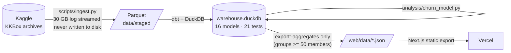

# Subscription Churn Analytics

**Revenue, retention and churn analysis of real subscription data. 20M billing transactions and 400M listening events from KKBox, Asia's largest music-streaming service, turned into an MRR bridge, cohort retention, and a churn model that is tested out-of-time.**

**Live site: [subscription-churn-analytics.vercel.app](https://subscription-churn-analytics.vercel.app)** · Static, so it never sleeps and loads instantly.

---

## Questions it answers

1. **Where does revenue come from, and where does it leak?** A monthly MRR bridge (new, reactivation, expansion, contraction, churn) that reconciles to the cent.
2. **How long do members stay?** Cohort retention, plus trailing-12-month net and gross revenue retention (the standard definition, not the one-month ratio that often gets mislabelled as NRR).
3. **Why do members churn?** Churn rate at each renewal decision by billing setup, tenure, plan, price, and listening behaviour, plus the split between people who cancelled, people who just didn't renew, and auto-renewals that failed.
4. **Can we see churn coming?** A rule-based score, logistic regression and gradient boosting, trained on 2016 and scored once on Jan–Feb 2017, compared by AUC and by the share of churners each reaches in its top-risk decile.

## Findings

From 23.0M transactions, 410M member-days of listening and 12.1M renewal decisions (Jan 2016 – Feb 2017). All figures are in New Taiwan dollars; every number on the site is computed at build time.

1. **Growth is real but leaky.** MRR reached **NT$151.1M** from **1.17M paying members** in Feb 2017 (+15.8% year over year). Over the same twelve months, **NT$79.0M of monthly revenue churned**: 96% of all revenue lost, against only 4% from downgrades. Trailing-twelve-month **NRR is 77.7%** and **GRR 76.0%**. Monthly subscriber churn averages **4.35%**, which replaces about **41%** of the base every year.
2. **Win-back is a major revenue source.** Returning members contributed **NT$38.5M** of monthly revenue, 39% of everything brought in by new and returning members. **8.9%** of renewals by returning members churn, against 4.3% for everyone else: they come back, but they are fragile.
3. **How someone pays matters more than how much they listen.** Manual renewers churn at **20.9%** per renewal against **2.8%** on auto-renew (7.5×). Members who cancel mid-period churn **77.6%** of the time. Listening barely separates churners from stayers (4.3–6.7% across activity bands), consistent with KKBox having a free tier: roughly a third to over half of churners (31–57%, by month) keep listening afterwards.
4. **Three kinds of churn, three different fixes.** **24%** of churners actively cancelled, **52%** were manual renewers who simply didn't renew, and **24%** had auto-renew switched on but the renewal never went through (likely payment failure).
5. **Promotions attract short-lived members.** Periods bought at 50%+ off churn at **69.2%** (13.6× full price), and ≤7-day plans at **50.7%**. Members in their first three months churn at 2.9× the rate of those past a year.
6. **Churn is predictable, mostly from billing signals.** Scored once on Jan–Feb 2017 after training on 2016, gradient boosting reaches **AUC 0.944** (validation 0.874). Its riskiest **10% of members contains 82% of churners**, against 68% for a hand-written rule score. A listening-only model reaches just 0.68.

**What I'd test first** (these are associations, so each is an experiment, not a conclusion):
- Default new and returning members into auto-renew at checkout, and measure the effect with an A/B test on first-renewal churn.
- Add payment-retry and dunning for auto-renew failures, which make up a quarter of churn and are the cheapest to recover.
- Point retention offers at the model's top decile rather than at everyone, and judge them on churners saved per offer.
- Measure deep-discount and trial acquisition on how many members convert to a second paid period at full price, not on sign-ups.

**Data-quality work** that changed the answers: repaired 23 payment-method-months missing from the billing export (a naive read showed a false 14% churn spike), inferred plan length for 3.7% of transactions recorded as zero days, fixed a survivor bias that had overstated 12-month retention by ~20 points, and removed a label leak from the churn model. The churn flag agrees with **Kaggle's own labelling code for 99.5%** of members; Kaggle's published labels agree with that same code only 98.8% of the time.

## How it works



| Layer | Model | What it does |
|---|---|---|
| staging | `stg_transactions`, `stg_members`, `stg_user_logs_monthly` | Types, cleaning (e.g. KKBox's notoriously dirty age field), revenue normalised to 30 days |
| intermediate | `int_billing_events` | One billing event per member per day; a same-day cancellation wins over a renewal |
| | `int_billing_data_gaps` | Payment-method-months missing from the billing export (< 25% of typical volume) |
| | `int_billing_events_sequenced` | **Gaps-and-islands**: splits events into continuous subscription spells; a lapse under 30 days is a late renewal, not churn; lapses explained by an export gap are bridged |
| | `int_paying_months` | Month-end snapshots; price via `ASOF JOIN` to the latest paid period |
| marts | `fct_subscriber_months` | Every member-month classified: new / expansion / contraction / churned / reactivation / retained |
| | `mrr_bridge_monthly` | MRR bridge, subscriber churn rate, monthly and trailing-12-month NRR/GRR |
| | `cohort_retention` | Logo and revenue retention by first-paid month (fully observed cells only) |
| | `int_renewal_labels` → `fct_renewal_decisions` | One row per paid period at expiry: churned or renewed, plus features known beforehand. Censored periods are dropped |
| audit | `audit_kaggle_labeller`, `audit_label_agreement` | Kaggle's own labelling script re-implemented in SQL; the build fails if our churn flag agrees with it less than 99% of the time |

**Tests** (`dbt build` runs them): the MRR bridge reconciles every month (`beginning + gains − losses = ending`), ≥ 99% agreement with Kaggle's labelling code, grain uniqueness on every table, accepted movement types, and retention and churn rates within [0, 1].

**Definitions worth defending in an interview**
- *Churn* = no new membership period within 30 days of expiry. This is the competition's own definition, checked against its own labelling code (99.5% agreement).
- *MRR* = latest paid price × 30 ÷ plan days, for members whose spell covers the month's last day. Kept in NT$; no invented FX rate.
- *NRR (T12M)* = revenue today from members paying 12 months ago ÷ what they paid then.
- *Model evaluation* = out-of-time split, model chosen on validation, test scored once. A listening-only variant shows how much behaviour reveals before any billing action.

## Reproduce

```bash
make setup        # Python env (.pyenv) + web deps
make data         # Kaggle download + staging — see scripts/fetch_kkbox.sh for the one-time token setup
make all          # dbt build + tests -> model backtest -> JSON export -> static site in web/out
```

No Kaggle account? `make fixture` runs the identical pipeline on a small synthetic dataset in KKBox's raw format; CI does this on every push.

## Repository

```
scripts/     ingest.py (raw -> Parquet, streaming), fetch_kkbox.sh, make_fixture.py, export_site_data.py
transform/   dbt project (staging -> intermediate -> marts) + tests
analysis/    churn_model.py — out-of-time backtest
web/         Next.js static site (ECharts), data/ = exported aggregates
```

## Data licence

KKBox data comes from the [WSDM Cup 2018 Kaggle competition](https://www.kaggle.com/competitions/kkbox-churn-prediction-challenge) and is used under its rules. Raw and member-level data are not redistributed: `data/` is git-ignored, and the site publishes only aggregates of 50 or more members.
